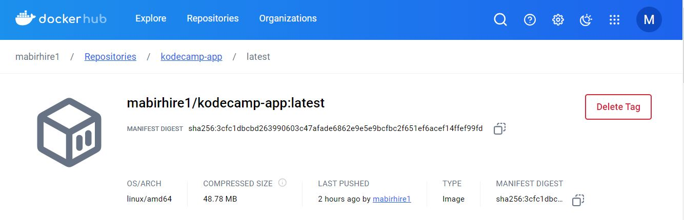
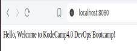
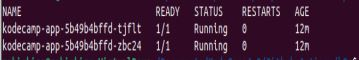

# CI/CD Pipeline with GitHub Actions to Deploy to Minikube on EC2
This project demonstrates how to set up a CI/CD pipeline using GitHub Actions to deploy a simple web application from a GitHub repository to a Minikube cluster running on an EC2 instance, which is provisioned using Terraform.

## Objective

Set up a CI/CD pipeline with GitHub Actions to deploy a code from GitHub to a Minikube cluster running on an EC2 instance deployed using Terraform.
Ensure the application is containerized with Docker and properly deployed to the Kubernetes cluster,screenshots
taken,Terraform modules and Kubernetes manifests included.

### Steps

**Step 1:**

### Create a Repository on GitHub: git@github.com:mabirhire1/k-4.0-github-actions.git 

### Create a Simple Web Application:
   - Use Python with Flask to display "Hello, Welcome to KodeCamp DevOps Bootcamp!"
   - 
### Dockerize the Application:
   - Write a Dockerfile
   - Tag and push Docker image to Docker Hub

Docker Hub URL: https://hub.docker.com/r/mabirhire1/kodecamp-app:latest

### Deploy to Kubernetes:
   - Create Kubernetes deployment and service manifests
   - Deploy to Minikube cluster

   
**Step 3:** Set Up Terraform for EC2 and Minikube
  - Create Terraform Modules:

**Step 4:** Access the Minikube Cluster
  - SSH into EC2 Instance:

**Step 5:** Automate Deployment with GitHub Actions
  - Update GitHub Actions Workflow:

### Conclusion
This guide demonstrates setting up a CI/CD pipeline with GitHub Actions to deploy a containerized application to a Minikube cluster running on an EC2 instance. The Terraform modules, Kubernetes manifests, and GitHub Actions workflow are essential components for achieving this deployment pipeline